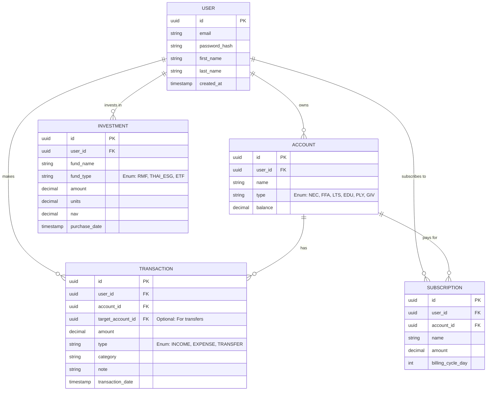

# Vault Pro: API & Database Summary with Examples

This document serves as a comprehensive reference for the Vault Pro system's database relationships, schema example data, and RESTful API endpoints. 

---

## 1. Database Schema & Relationships

### 1.1 Entity Relationship Diagram (ERD)

The system consists of five primary entities: `User`, `Account` (representing the 6 Jars system), `Transaction`, `Subscription`, and `Investment`. 



### 1.2 Example Database Data

To illustrate how data is stored, here are JSON representations of mock database rows for each major entity. Note the use of `decimal` for precise financial values.

**Users Table (Mock Row)**
```json
{
  "id": "123e4567-e89b-12d3-a456-426614174000",
  "email": "alex.invest@example.com",
  "password_hash": "$2a$12$R9h...hashed...string...",
  "first_name": "Alex",
  "last_name": "Doe",
  "created_at": "2026-05-22T08:00:00Z"
}
```

**Accounts Table (Mock Rows - 6 Jars)**
```json
[
  {
    "id": "550e8400-e29b-41d4-a716-446655440000",
    "user_id": "123e4567-e89b-12d3-a456-426614174000",
    "name": "Necessity Fund",
    "type": "NEC",
    "balance": "15000.50",
    "created_at": "2026-05-22T08:05:00Z"
  },
  {
    "id": "660e8400-e29b-41d4-a716-446655440001",
    "user_id": "123e4567-e89b-12d3-a456-426614174000",
    "name": "Play Account",
    "type": "PLY",
    "balance": "3000.00",
    "created_at": "2026-05-22T08:05:00Z"
  }
]
```

**Transactions Table (Mock Rows)**
```json
[
  {
    "id": "770e8400-e29b-41d4-a716-446655440000",
    "user_id": "123e4567-e89b-12d3-a456-426614174000",
    "account_id": "550e8400-e29b-41d4-a716-446655440000",
    "target_account_id": null,
    "amount": "120.00",
    "type": "EXPENSE",
    "category": "Groceries",
    "note": "Supermarket purchase",
    "transaction_date": "2026-05-22T10:30:00Z"
  },
  {
    "id": "880e8400-e29b-41d4-a716-446655440000",
    "user_id": "123e4567-e89b-12d3-a456-426614174000",
    "account_id": "550e8400-e29b-41d4-a716-446655440000",
    "target_account_id": "660e8400-e29b-41d4-a716-446655440001",
    "amount": "500.00",
    "type": "TRANSFER",
    "category": "Internal Transfer",
    "note": "Transfer to Play Account",
    "transaction_date": "2026-05-22T11:00:00Z"
  }
]
```

---

## 2. API Endpoints Overview & Examples

All protected endpoints require a valid JWT Access Token passed via the HTTP Header:
`Authorization: Bearer <access_token>`

### 2.1 Authentication APIs
These endpoints manage user identities and sessions securely using JWT.

*   **`POST /api/v1/auth/register`**
    *   **Explanation**: Registers a new user in the system. Hashes the password securely and sets up initial Jar data.
    *   **Example Request Body:**
        ```json
        {
          "email": "alex.invest@example.com",
          "password": "SecurePassword123!",
          "first_name": "Alex",
          "last_name": "Doe"
        }
        ```
    *   **Example Response (201 Created):**
        ```json
        {
          "message": "User registered successfully",
          "user_id": "123e4567-e89b-12d3-a456-426614174000"
        }
        ```

*   **`POST /api/v1/auth/login`**
    *   **Explanation**: Authenticates the user and returns an Access Token in the response body. A long-lived Refresh Token is typically set as an `HttpOnly` cookie.
    *   **Example Request Body:**
        ```json
        {
          "email": "alex.invest@example.com",
          "password": "SecurePassword123!"
        }
        ```
    *   **Example Response (200 OK):**
        ```json
        {
          "access_token": "eyJhbGciOiJIUzI1NiIsInR5cCI6IkpXVCJ9...",
          "expires_in": 1800,
          "user": {
            "id": "123e4567-e89b-12d3-a456-426614174000",
            "email": "alex.invest@example.com"
          }
        }
        ```

*   **`GET /api/v1/auth/me`**
    *   **Explanation**: Retrieves the profile details of the currently logged-in user based on the provided JWT.

### 2.2 Dashboard APIs
These endpoints provide aggregated data crucial for rendering the frontend charts and summary cards.

*   **`GET /api/v1/dashboard/summary`**
    *   **Explanation**: Calculates and returns the total balance across all 6 Jars, alongside the total income and expenses for the current month.
    *   **Example Response:**
        ```json
        {
          "total_balance": "85000.00",
          "monthly_income": "100000.00",
          "monthly_expenses": "15000.00",
          "jars_summary": [
            { "type": "NEC", "balance": "40000.00", "percentage": 47.05 },
            { "type": "FFA", "balance": "15000.00", "percentage": 17.64 }
          ]
        }
        ```

*   **`GET /api/v1/dashboard/expenses-by-category`**
    *   **Explanation**: Groups transaction amounts by category to easily feed data into pie/donut charts for visualizations.
    *   **Example Response:**
        ```json
        {
          "data": [
            { "category": "Food & Dining", "total": "5500.00" },
            { "category": "Transportation", "total": "2000.00" },
            { "category": "Utilities", "total": "1500.00" }
          ]
        }
        ```

### 2.3 Transaction Engine APIs
Core CRUD endpoints for managing daily financial activity.

*   **`GET /api/v1/transactions`**
    *   **Explanation**: Retrieves a paginated list of transactions, supporting optional query parameters for filtering (e.g., `?month=05&year=2026`).
*   **`POST /api/v1/transactions`**
    *   **Explanation**: Creates a new transaction. Must specify the account and type (Income, Expense, Transfer). If the type is Transfer, `target_account_id` is required.
    *   **Example Request Body (Expense):**
        ```json
        {
          "account_id": "550e8400-e29b-41d4-a716-446655440000",
          "amount": "250.00",
          "type": "EXPENSE",
          "category": "Dining Out",
          "note": "Lunch with team",
          "transaction_date": "2026-05-22T12:00:00Z"
        }
        ```
    *   **Example Request Body (Transfer):**
        ```json
        {
          "account_id": "550e8400-e29b-41d4-a716-446655440000",
          "target_account_id": "660e8400-e29b-41d4-a716-446655440001",
          "amount": "1000.00",
          "type": "TRANSFER",
          "category": "Internal Transfer",
          "note": "Moving extra funds to Play account",
          "transaction_date": "2026-05-22T13:00:00Z"
        }
        ```
*   **`PUT /api/v1/transactions/{id}`**
    *   **Explanation**: Updates details of an existing transaction (e.g., fixing a typo in the amount or re-categorizing).
*   **`DELETE /api/v1/transactions/{id}`**
    *   **Explanation**: Removes a transaction entirely (or soft-deletes it) and recalibrates account balances accordingly.

### 2.4 Subscriptions & Investments APIs
Endpoints for long-term and recurring financial tracking.

*   **`GET /api/v1/subscriptions`**
    *   **Explanation**: Lists all recurring monthly expenses tied to a user.
*   **`POST /api/v1/subscriptions`**
    *   **Explanation**: Adds a new recurring subscription.
    *   **Example Request Body:**
        ```json
        {
          "account_id": "550e8400-e29b-41d4-a716-446655440000",
          "name": "Netflix Premium",
          "amount": "419.00",
          "billing_cycle_day": 15
        }
        ```

*   **`GET /api/v1/investments`**
    *   **Explanation**: Retrieves the user's investment portfolio, categorized by fund type (e.g., RMF, Thai ESG) to aid in tax deduction planning.
*   **`POST /api/v1/investments/buy`**
    *   **Explanation**: Records the purchase of investment units.
    *   **Example Request Body:**
        ```json
        {
          "fund_name": "K-USA-A(D)",
          "fund_type": "ETF",
          "amount": "5000.00",
          "units": "245.55",
          "nav": "20.3624",
          "purchase_date": "2026-05-22T09:00:00Z"
        }
        ```
